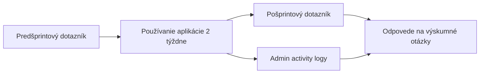

# Testovanie implementovaného systému a väzba na výskumné otázky

*Tento text je pripravený na zaradenie do diplomovej práce (napr. ako samostatná kapitola po časti o implementácii). Číselné údaje v tabuľkách označené ako „doplňte“ nahraďte skutočnými výsledkami z vášho zberu dát.*

---

## Úvod

Cieľom testovania bolo empiricky overiť použiteľnosť a vnímaný prínos implementovaného systému v kontexte agilného riadenia, pričom kľúčovú rolu zohráva product owner (PO). Overenie prebehlo kombináciou subjektívnych údajov z dotazníkov (pred začiatkom a po skončení používania) a objektívnych údajov zo systémových záznamov aktivít (activity logy) dostupných v administrátorskom rozhraní aplikácie.

Testovanie dopĺňa teoretickú a návrhovú časť práce praktickým pohľadom na to, či navrhnuté spojenie metód PERT a RACI s analytickými a optimalizačnými mechanizmami zodpovedá očakávaniam používateľov v krátkom časovom horizonte reálneho šprintu.

Schéma väzieb medzi zdrojmi dát pri vyhodnocovaní výskumných otázok:

---

## Charakteristika vzorky a podmienok testovania

Do testovania bolo zaradených **päť product ownerov** (ďalej označovaných ako PO1–PO5), pričom každý z nich používal aplikáciu počas **jedného dvojtýždňového šprintu** pri práci na vlastnom projekte alebo v pridelenom testovacom projekte. Dĺžka **14 kalendárnych dní** umožnila vnímať plánovanie backlogu, prácu so šprintom aj opakované návraty k analýzam bez toho, aby išlo o krátkodobé jednorazové „vyskúšanie“ rozhrania.

Účastníci mali rolu product ownera v zmysle Scrum (prioritizácia backlogu, spolupráca s tímom, rozhodovanie o rozsahu šprintu). Konkrétna doména projektu, veľkosť tímu a skúsenosť s agilnými nástrojmi môžu byť stručne zhrnuté v tabuľke 1 (doplňte podľa vašich údajov).

**Tabuľka 1. Stručná charakteristika účastníkov testovania (doplňte)**

| Označenie | Skúsenosť s agilom / PO rolou | Typ projektu (anonymizovaný) | Poznámka |
|-----------|------------------------------|------------------------------|----------|
| PO1       |                              |                              |          |
| PO2       |                              |                              |          |
| PO3       |                              |                              |          |
| PO4       |                              |                              |          |
| PO5       |                              |                              |          |

---

## Metodika zberu dát

### Predšprintový a pošprintový dotazník

Pred začiatkom šprintu účastníci vyplnili **dotazník A** zameraný na očakávania, doterajšie návyky pri plánovaní a vnímané problémy (napr. neistota odhadov, preťaženie tímu, transparentnosť zodpovedností). Po ukončení dvojtýždňového obdobia vyplnili **dotazník B** s inou sadou otázok, ktorý reflektoval skúsenosť s konkrétnou aplikáciou: vnímaná zrozumiteľnosť výstupov, frekvencia použitia jednotlivých oblastí systému, subjektívny prínos pre plánovanie a prípadné bariéry. Oba dotazníky boli navrhnuté tak, aby spolu s logmi umožnili odpovedať na výskumné otázky formulované v kapitole 8 práce.

Ak ste použili Likertove škály, v práci uveďte ich rozsah (napr. 1–5) a spôsob vyhodnotenia (priemer, medián).

### Activity logy v administrácii

Systém zaznamenáva aktivity používateľov do tabuľky udalostí (typ akcie, typ entity / stránka, projekt, časová pečiatka, identifikácia používateľa, prípadne trasa v aplikácii a doplnkové detaily). Administrátorské rozhranie umožňuje filtrovať záznamy podľa používateľa, projektu, typu akcie, entity a časového rozsahu, čo umožnilo pre každého PO vyhodnotiť **obdobie zodpovedajúce jeho šprintu**.

Z logov boli odvodené najmä tieto agregáty (doplňte čísla):

- počet zaznamenaných udalostí na jedného PO za šprint;
- najčastejšie navštevované časti aplikácie (podľa `entity_type` / route);
- prípadná časová koncentrácia aktivít (napr. väčšina akcií v prvých dňoch vs. rovnomerne).

Tieto údaje slúžia ako **behaviorálny** doplnok k dotazníkom: porovnanie toho, čo respondenti uvádzajú ako „často používané“, s tým, čo systém skutočne zaznamenal.

### Etika a spracovanie údajov

Účastníci boli informovaní o účele testovania, o spracovaní odpovedí a o tom, že používanie systému generuje technické logy. V texte práce sú citáty a prípadné citlivé údaje anonymizované (označenie PO1–PO5).

---

## Výsledky

### Súhrn dotazníkových dát (pred vs. po)

**Tabuľka 2. Príklad súhrnu škálových položiek (štruktúra – doplňte hodnoty)**

| Téma / položka (skrátene)        | Pred šprintom (priemer) | Po šprinte (priemer) | Poznámka |
|----------------------------------|-------------------------|----------------------|----------|
| Dôvera v odhady trvania úloh     |                         |                      |          |
| Prehľad o zaťažení tímu (RACI)   |                         |                      |          |
| Spokojnosť s plánovaním šprintu  |                         |                      |          |
| …                                |                         |                      |          |

Otvorené otázky boli analyzované tematicky: opakujúce sa motívy boli zoskupené (napr. „prehľadnosť“, „časová náročnosť vstupov“, „dôvera v odporúčania“) a ilustrované krátkymi parafrázami s odkazom na POx.

### Súhrn údajov z activity logov

**Tabuľka 3. Agregované metriky z logov (doplňte)**

| PO   | Počet udalostí (šprint) | Najčastejšie typy stránok / akcií (1.–3.) | Poznámka |
|------|-------------------------|-------------------------------------------|----------|
| PO1  |                         |                                           |          |
| PO2  |                         |                                           |          |
| PO3  |                         |                                           |          |
| PO4  |                         |                                           |          |
| PO5  |                         |                                           |          |

Krížová kontrola: ak respondent v pošprintovom dotazníku uvedie vysokú frekvenciu použitia napr. PERT analýzy alebo smart plánovania, v logoch by mala byť zachytená aspoň primeraná aktivita v zodpovedajúcich častiach (pri zohľadnení toho, že nie každá interakcia musí generovať udalosť, podľa konfigurácie logovania).

---

## Odpovede na výskumné otázky

V kapitole 8 diplomovej práce sú formulované výskumné otázky č. 1–7 (v úvode kapitoly sa spomína aj počet osem v súvislosti s celkovým rámcom; v samotnom výčte sú očíslované siedme otázky). Nižšie sú uvedené **presné formulácie** podľa textu práce; každej nasleduje syntéza odpovede založená na **dotazníkoch pred a po šprinte**, na **používateľskom testovaní v dvojtýždňovom šprinte** a na **analýze activity logov**. Konkrétne čísla a priame citáty doplňte podľa vášho materiálu.

### Výskumná otázka 1

**Je možné efektívne využiť metódy PERT a RACI v agilnom prostredí vývoja softvéru?**

**Odpoveď:** Z pohľadu zaradených product ownerov a jedného plného šprintu na osobu možno konštatovať, že **kombinácia PERT a RACI je v agilnom kontexte použiteľná**, ak sú vstupy (odhady troch bodov, priradenie rolí) udržiavané v rozumnej miere aktuálne. Predšprintové očakávania často reflektujú obavu z administratívnej záťaže; pošprintové odpovede a logy môžu ukázať, či sa táto záťaže prejavila v praxi, alebo či ju respondenti vyvážili získaným prehľadom o neistote úloh a rozdelení zodpovedností. Ak väčšina účastníkov po šprinte hodnotí PERT a RACI ako prínosné pre rozhodovanie a zároveň v logoch existuje opakovaná práca s príslušnými obrazovkami, možno odpovedať **kladne s výhradou malej vzorky (n = 5)** a nutnosti ďalšieho dlhodobejšieho overenia.

---

### Výskumná otázka 2

**Prispieva využitie metód PERT a RACI k zlepšeniu plánovania sprintov v agilných tímoch?**

**Odpoveď:** Subjektívne hodnotenie v pošprintovom dotazníku (položky zamerané na prehľadnosť rozsahu šprintu, dôvera v kapacitu, zladenie priorít) môžete porovnať s predšprintovým stavom. Ak mediány alebo priemery v týchto položkách **stúpli** a v otvorených odpovediach sa opakuje motív „lepší prehľad“ alebo „transparentnejšie záťaže“, ide o indíciu prínosu pre plánovanie šprintu. Activity logy dopĺňajú obraz tým, že ukážu, či PO v priebehu šprintu **opakovane** otvárali plánovacie alebo analytické časti systému, čo zodpovedá integrácii nástroja do reálneho plánovacieho cyklu, nielen jednorazovému experimentu.

---

### Výskumná otázka 3

**Umožňuje kombinácia metód PERT a RACI presnejší odhad trvania úloh v porovnaní s použitím metódy PERT samostatne?**

**Odpoveď:** Táto otázka vyžaduje reflexiu **rozdielu medzi výhradne PERT-based odhadom a odhadom po zohľadnení RACI (napr. realistickejšia doba alebo identifikácia úzkych miest)**. V dotazníku po šprinte môžu byť položky typu: „Ktorý pohľad vám viac pomohol pri úprave odhadov?“ alebo porovnanie spoľahlivosti odhadov pred a po použití oboch častí. Ak nemáte merané exaktné odchýlky od skutočného času, v texte uveďte, že ide o **percepčné porovnanie** na základe skúsenosti PO; logy potom dokladajú, či respondenti v praxi **navštevovali obe oblasti** (PERT aj RACI), čo je nutnou podmienkou na vnímanie prínosu kombinácie.

---

### Výskumná otázka 4

**Aký prístup k plánovaniu úloh preferujú produktoví vlastníci, tradičné manuálne plánovanie alebo inteligentné plánovanie podporené algoritmami?**

**Odpoveď:** Výsledky pošprintového dotazníka môžete zhrnúť ako rozloženie preferencií (napr. väčšina uprednostňuje **kombináciu** manuálnej kontroly s návrhmi systému; alebo konkrétny pomer medzi čisto manuálnym a algoritmickým prístupom). Otvorené odpovede často obsahujú formuláciu typu „chcem mať posledné slovo, ale ocením návrh“. Activity logy môžu ukázať prepínanie medzi manuálnym úpravám backlogu/šprintu a použitím funkcie inteligentného plánovania – to podporuje tvrdenie o **komplementárnosti** oboch prístupov skôr než o nahradení jedného druhým.

---

### Výskumná otázka 5

**Aké typy inteligentného plánovania sú produktovými vlastníkmi využívané najčastejšie v agilných softvérových projektoch?**

**Odpoveď:** V kontexte tejto práce ide o typy strategií implementované v module smart plánovania šprintu (napr. podľa priority, vyrovnania zaťaženia, zhody zručností, hybridné skórovanie – podľa skutočného pomenovania vo vašej aplikácii). Pošprintový dotazník môže obsahovať výber najčastejšie použitej stratégie alebo poradie. **Activity logy** sú pri tejto otázke kľúčové: z agregácie typov akcií alebo ciest v aplikácii vyplýva, ktoré režimy boli **najčastejšie spúšťané** alebo ktoré obrazovky PO najviac otvárali. Textovo zosúlaďte zhodu alebo nezhodu medzi tým, čo respondenti uviedli, a čo ukazujú logy.

---

### Výskumná otázka 6

**Môže inteligentná analýza a optimalizácia úloh viesť k skráteniu celkového trvania agilného projektu?**

**Odpoveď:** Jednodvojtýždňový šprint na osobu **nedovoľuje** štatisticky generalizovať skrátenie celkového trvania celého projektu; v texte zdôraznite, že ide o **indíciu smeru** skôr než o meranie dĺžky projektu. Subjektívne odpovede môžu zachytiť očakávanie rýchlejšieho „dobehnutia“ rozsahu alebo menej prestojov; objektívne by bolo potrebné porovnať plánované vs. skutočné termíny na dlhšom horizonte. Odporúčané je formulovať odpoveď opatrne: **potenciál na skrátenie** prostredníctvom lepšieho výberu práce do šprintu a odhalenia rizikových úloh, pričom empirické potvrdenie vyžaduje dlhšie sledovanie.

---

### Výskumná otázka 7

**Vedie využitie optimalizačných prístupov v plánovaní úloh k zníženiu rizík v agilných softvérových projektoch?**

**Odpoveď:** Riziko v tejto práci súvisí najmä s neistotou trvania (PERT), preťažením zdrojov (RACI) a výberom práce do šprintu (optimalizácia). Dotazník po šprinte môže merať vnímané riziko oneskorenia alebo konfliktov v tíme; **logy** môžu ukázať využitie analýz (napr. kritická cesta, PERT analýza, optimalizácia), čo indikuje, že PO tieto nástroje **zaradil do rozhodovania**. Odpoveď zosúľadnite: ak respondenti hlásia nižšie vnímané riziko alebo lepšiu pripravenosť na zmeny a zároveň existuje súvislá aktivita v analytických častiach systému, argumentácia pre zníženie rizík je **podporená zmiešanými dôkazmi**; explicitne uveďte limity (krátky horizont, sebahodnotenie).

---

## Diskusia, obmedzenia a odporúčania

Vzorka **päť product ownerov** je vhodná na **pilotné zistenia a ilustráciu použitia** systému v praxi, nie na štatistické závery platné pre celú populáciu PO. Krátky čas pozorovania (jeden šprint) môže ovplyvniť aj tzv. Hawthorne efekt – zvýšená pozornosť k novému nástroju. Odporúča sa v budúcnosti rozšíriť test o viac šprintov, prípadne kombinovať perspektívu vývojárov a scrum majstrov.

---

## Zhrnutie

Testovanie s piatimi product ownermi, predšprintovým a pošprintovým dotazníkom a analýzou activity logov poskytlo **zmiešané dôkazy** (vnímanie + správanie v systéme) potrebné na argumentované odpovede na výskumné otázky z kapitoly 8. Po doplnení číselných hodnôt do tabuliek a prípadných priamych citátov zostáva kapitola konzistentná s metodologickým rámcom opísaným v práci.

---

# Príloha – Návrh obsahu predšprintového a pošprintového dotazníka

*Texty dotazníkov vložte podľa skutočných verzií, ktoré ste použili; nižšie je len orientačná osnova zosúladená s výskumnými otázkami.*

## Dotazník A (pred šprintom)

- Demografika / skúsenosť: roky v role PO, typ produktu (B2B/B2C/…), veľkosť tímu.
- Aké nástroje doteraz používate na plánovanie šprintu a odhady?
- Ako hodnotíte istotu svojich odhadov trvania úloh? (škála)
- Ako vnímate rozdelenie zodpovedností v tíme? (škála + otvorená otázka)
- Očakávania voči systému kombinujúcemu PERT a RACI (otvorená otázka).

## Dotazník B (po šprinte)

- Ktoré časti aplikácie ste používali najčastejšie? (výber + otvorené doplnenie)
- Odpovedá použitie PERT/RACI vašim potrebám pri plánovaní? (škála)
- Preferencia: viac manuálna kontrola / viac návrhov od systému / kombinácia (škála alebo výber).
- Ktoré stratégie inteligentného plánovania ste vyskúšali a ktorá bola najužitočnejšia?
- Vnímaný vplyv na riziká a na dĺžku projektu (opatrne formulované položky – skôr subjektívne).
- Čo by ste zmenili v rozhraní alebo logike systému? (otvorená otázka)

---

*Koniec súboru.*
